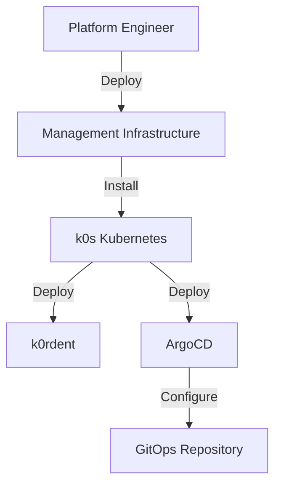
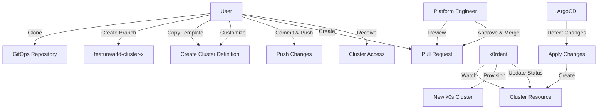
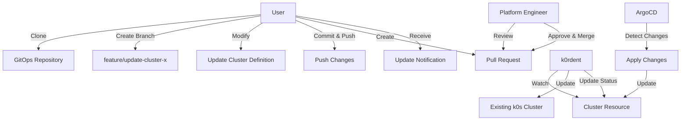
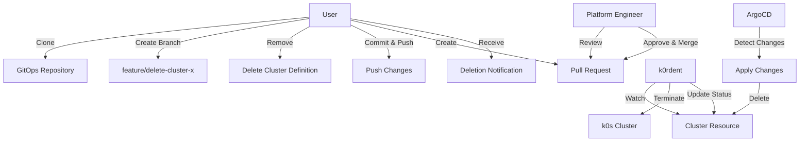

# GitOps Workflow for k0rdent-ops

This document explains the GitOps workflow used in k0rdent-ops for managing Kubernetes clusters.

## What is GitOps?

GitOps is a way of implementing Continuous Deployment for cloud native applications. It focuses on a developer-centric experience when operating infrastructure, by using tools developers are already familiar with, including Git and Continuous Deployment tools.

The core principles of GitOps are:

1. **Declarative**: The entire system is described declaratively
2. **Versioned and Immutable**: The desired state is versioned in Git and its history is immutable
3. **Pulled Automatically**: Software agents automatically pull the desired state declarations from the source
4. **Continuously Reconciled**: Software agents continuously observe actual system state and attempt to apply the desired state

## k0rdent-ops GitOps Workflow

The k0rdent-ops platform implements GitOps using ArgoCD and a Git repository containing cluster definitions. Here's how the workflow operates:

### Components

1. **Git Repository**: Contains the desired state of all clusters
2. **ArgoCD**: Monitors the Git repository and applies changes to the Kubernetes cluster
3. **k0rdent**: Manages the lifecycle of k0s clusters based on the cluster definitions
4. **Pull Requests**: Used for proposing, reviewing, and approving changes

### Workflow Steps

#### 1. Initial Setup

The platform engineer sets up the initial infrastructure:



#### 2. Cluster Creation

Users create new clusters through the GitOps workflow:



#### 3. Cluster Updates

Users update existing clusters through the GitOps workflow:



#### 4. Cluster Deletion

Users delete clusters through the GitOps workflow:



## Detailed Process

### 1. Clone the Repository

```bash
git clone https://github.com/mgueye01/k0rdent-ops/cluster-templates.git
cd cluster-templates
```

### 2. Create a New Branch

```bash
git checkout -b feature/add-cluster-dev01
```

### 3. Create or Modify Cluster Definition

For a new cluster, copy the template:

```bash
cp templates/cluster-template.yaml clusters/dev-cluster-01.yaml
```

Edit the cluster definition:

```yaml
apiVersion: k0rdent.io/v1alpha1
kind: Cluster
metadata:
  name: dev-cluster-01
  labels:
    environment: development
    team: engineering
spec:
  region: us-east-1
  
  networking:
    vpcCidr: "10.0.0.0/16"
    publicIp: true
  
  nodes:
    controllers:
      count: 1
      instanceType: t3.medium
    
    workers:
      count: 3
      instanceType: t3.large
  
  k0s:
    version: "1.28.3+k0s.0"
  
  ssh:
    keyName: k0rdent
  
  addons:
    ingress:
      enabled: true
    metricsServer:
      enabled: true
```

### 4. Commit and Push Changes

```bash
git add clusters/dev-cluster-01.yaml
git commit -m "Add development cluster dev-cluster-01"
git push -u origin feature/add-cluster-dev01
```

### 5. Create a Pull Request

Create a pull request on GitHub with the following information:

- **Title**: Add development cluster dev-cluster-01
- **Description**: 
  - Purpose of the cluster
  - Team that will use it
  - Expected lifetime
  - Any special requirements

### 6. Review and Approval

The platform engineering team reviews the pull request:

- Checks if the cluster configuration is valid
- Ensures it follows best practices
- Verifies resource requests are reasonable
- Confirms it doesn't conflict with existing clusters

### 7. Merge the Pull Request

Once approved, the pull request is merged to the main branch.

### 8. Automated Deployment

After the merge:

1. ArgoCD detects the change in the Git repository
2. ArgoCD applies the new cluster definition to the Kubernetes cluster
3. k0rdent detects the new cluster resource
4. k0rdent provisions the new k0s cluster according to the specification
5. k0rdent updates the status of the cluster resource

### 9. Access the Cluster

Once the cluster is provisioned:

1. The user receives a notification that the cluster is ready
2. The user can download the kubeconfig from the k0rdent dashboard
3. The user can access the cluster using kubectl

## Best Practices

### 1. Branch Naming

Use a consistent branch naming convention:

- `feature/add-cluster-<n>` for new clusters
- `feature/update-cluster-<n>` for updates
- `feature/delete-cluster-<n>` for deletions

### 2. Commit Messages

Write clear and descriptive commit messages:

- Start with a verb (Add, Update, Delete)
- Include the cluster name
- Provide context in the body if needed

### 3. Pull Request Description

Include the following in your pull request description:

- Purpose of the change
- Expected impact
- Testing done
- Timeline for implementation

### 4. Code Reviews

When reviewing pull requests:

- Check for security implications
- Verify resource requests are appropriate
- Ensure compliance with organizational policies
- Look for potential conflicts with other clusters

### 5. Testing

Before submitting a pull request:

- Validate your YAML syntax
- Test with a local validation tool if available
- Consider using a staging environment for complex changes

## Troubleshooting

### Common Issues

#### 1. Pull Request Not Being Processed

If your pull request is not being processed by ArgoCD:

- Check if the CI/CD pipeline is running
- Verify that your YAML is correctly formatted
- Ensure that the branch is up to date with the main branch
- Check for merge conflicts

#### 2. Cluster Creation Fails

If cluster creation fails:

- Check the ArgoCD logs for errors
- Look at the k0rdent controller logs
- Verify that the AWS credentials are valid
- Check if the requested resources are available in the specified region

#### 3. Cluster Updates Not Applied

If your cluster updates are not being applied:

- Verify that the pull request was merged
- Check if ArgoCD is syncing the changes
- Look for validation errors in the k0rdent logs
- Ensure that the update is compatible with the current state

## Advanced Topics

### 1. Multi-Environment Setup

For organizations with multiple environments (dev, staging, prod), consider:

- Using separate directories for each environment
- Implementing different approval workflows for each environment
- Setting up environment-specific validation rules

### 2. Automated Validation

Implement automated validation in your CI/CD pipeline:

- YAML syntax validation
- Schema validation against the CRD
- Policy checks (e.g., OPA/Gatekeeper)
- Cost estimation

### 3. Drift Detection

Set up drift detection to identify when the actual state of clusters diverges from the desired state:

- Regular reconciliation by k0rdent
- Alerting on persistent drift
- Automated remediation for certain types of drift

### 4. Secrets Management

For managing secrets in your GitOps workflow:

- Use a secrets management solution (e.g., Sealed Secrets, Vault)
- Never commit plain-text secrets to the repository
- Implement proper RBAC for secrets access

## Conclusion

The GitOps workflow in k0rdent-ops provides a structured, secure, and auditable way to manage Kubernetes clusters. By following this workflow, teams can collaborate effectively, maintain a clear history of changes, and ensure that their infrastructure remains in the desired state.